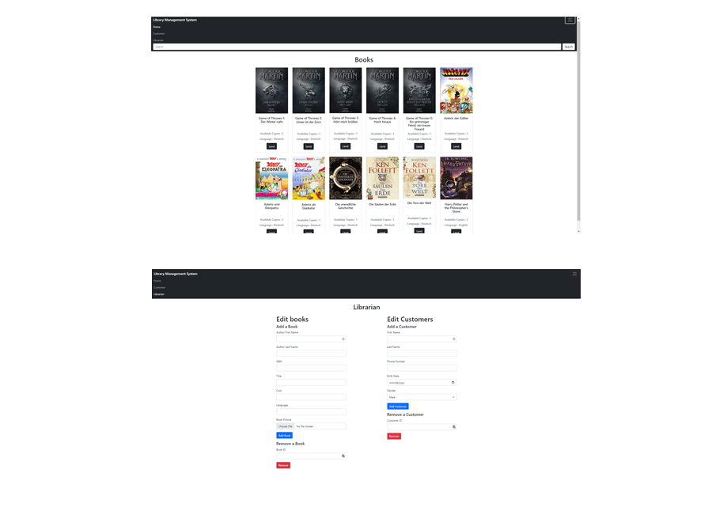

# Library Management System
A library management system created with Django, Bootstrap, Sqlite as a database storage. 

## **Features**:
- Display all available books
- Search for a specific book through an inbuilt filter
- Add / Remove books
- Add / Remove customers
- Rent a book
- Display all the books a customer has rented

## **Installation**:
To run the project cd into the librarymansys working directory and enter the following command : python manage.py runserver